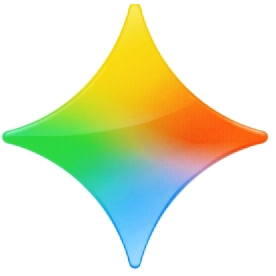

<!DOCTYPE html>
<html lang="ar" dir="rtl">
<head>
<meta charset="UTF-8"><meta name="viewport" content="width=device-width, initial-scale=1.0">
<title>Gemalot</title>

</head>
<body>

  

  

    
  

  
كيف يمكنني مساعدتك

  

    <button class="menu-btn" onclick="toggleSidebar()"></button>
    <button id="settingsBtn" class="menu-btn" style="background:rgba(255,255,255,.15)">⚙️</button>
    
25/25

  

  
Gemalot

  <button class="model-btn active" onclick="selectModel(this)">Gemalot Normal</button>
  <button class="model-btn locked" onclick="location.href='subscription.html'">Plus 45 🔒</button>
  <button class="model-btn locked" onclick="location.href='subscription.html'">Bronze 65 🔒</button>
  <button class="model-btn locked" onclick="location.href='subscription.html'">Silver 75 🔒</button>
  <button class="model-btn locked" onclick="location.href='subscription.html'">Gold 100 🔒</button>

  <button class="new-chat-btn" onclick="newChat()">+ محادثة جديدة</button>
  <h3>المحادثات السابقة</h3>
  

  

    
الوضع: عادي (25 رسالة/يوم)

    

  

  

    <h1>Gemalot</h1>
    

    
كيف يمكنني مساعدتك؟

    
متبقي: 25/25 اليوم - بدون سيرفر

  

  <button onclick="triggerUpload('image');closeTools()">🖼️ رفع صورة وتعديلها</button>
  <button onclick="triggerUpload('video');closeTools()">🎥 رفع فيديو</button>
  <button onclick="askImageGen();closeTools()">🎨 إنشاء صورة 4K</button>
  <button onclick="askVideoGen();closeTools()">🎬 إنشاء فيديو</button>
  <button onclick="insertPrompt('حل المعادلة: ');closeTools()">🧮 حل معادلة</button>

  

    <button class="plus-btn" id="plusBtn" onclick="toggleTools()">+</button>
    
<textarea id="userInput" placeholder="اسأل Gemalot" rows="1"></textarea>

    <button class="mic-btn" id="micBtn" onclick="toggleMic()">🎙️</button>
    <button id="sendBtn" class="send-btn wave">◍</button>
  

<input type="file" id="fileInput" hidden accept="image/*,video/*">

<h3 style="color:#facc15;font-size:14px">محرر احترافي - بدون سيرفر</h3><canvas id="editCanvas"></canvas>
<button onclick="applyFilter('grayscale')">أبيض وأسود</button><button onclick="applyFilter('sepia')">Sepia</button><button onclick="applyFilter('invert')">عكسي</button><button onclick="applyFilter('bright')">تفتيح</button><button onclick="rotateCanvas(90)">دوران</button><button onclick="addTextOverlay()">نص</button><button onclick="downloadCanvas()">تحميل</button><button onclick="closeEditor()">إغلاق</button>

</body>
</html>
